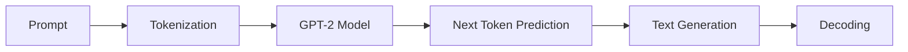

# Experiment 1: Text Generation using GPT-2 Large Language Model

## Aim
To generate meaningful text from a given prompt using a pretrained GPT-2 Large Language Model (LLM) available in the Hugging Face Transformers library.

---

## Objectives
1. Understand the concept of Large Language Models (LLMs).
2. Learn how tokenization is performed using the GPT-2 Tokenizer.
3. Generate text using a pretrained GPT-2 model.
4. Study the effect of generation parameters such as temperature, top-k, and top-p sampling.
5. Understand the workflow of prompt-based text generation.

---

## Theory

### Generative AI
Generative Artificial Intelligence (Generative AI) is a branch of AI that creates new content such as text, images, audio, video, and code by learning patterns from existing data.

### Large Language Models (LLMs)
Large Language Models are deep learning models trained on massive amounts of text data. They learn language patterns and can generate human-like text. Examples include GPT-2, GPT-3, GPT-4, LLaMA, Gemini, and Claude.

### GPT-2
GPT-2 (Generative Pre-trained Transformer 2) is an autoregressive language model developed by OpenAI. It predicts the next word in a sequence based on previously generated words.

### Tokenization
Before processing text, the input sentence is converted into tokens (numerical representations).
For example:
- **Input Text:** `"Artificial Intelligence"`
- **Tokenized Output (IDs):** `[8001, 9542]`

The model processes these tokens instead of the raw text.

### Text Generation Process


---

## Software & Hardware Requirements
* Python 3.x
* Google Colab / Jupyter Notebook
* PyTorch & Hugging Face Transformers

### Installation Commands
```bash
pip install transformers torch
```

---

## Algorithm
1. Import `GPT2LMHeadModel` and `GPT2Tokenizer` from the Transformers library.
2. Load the pretrained GPT-2 tokenizer (`gpt2`).
3. Load the pretrained GPT-2 model (`gpt2`).
4. Define the input prompt.
5. Convert the prompt into tokens (numerical IDs).
6. Create an attention mask.
7. Generate text using the GPT-2 model with specified hyperparameters (temperature, top_k, top_p, etc.).
8. Decode the generated tokens back into readable text.
9. Display the generated output.

---

## Sample Execution

### Sample Input
**Prompt:** `"Define Artificial Intelligence is transforming education.."`

### Sample Output
> "The Future is a new era of artificial intelligence. The future is not a dystopian future. It is the future of human civilization. We are living in a world where we are not only able to do things we want to, but also to be able, to make decisions that are in our best interest. This is what we call the "future."

*(Note: Output may vary each time due to probabilistic text generation settings such as temperature and top-k/top-p.)*

---

## Result
Thus, text generation was successfully performed using the pretrained GPT-2 Large Language Model. The model generated meaningful text based on the given prompt by predicting the next sequence of words.
